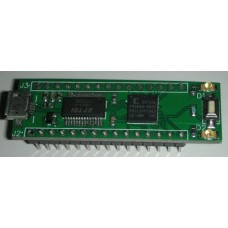
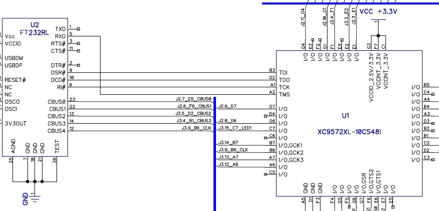

# XK2C95XL OpenOCD SVF Programmer(player)

  
Instructions to use openocd as 'pldKit XK2C95XL XILINX CPLD Kit' programmer (FT232R)

A tiny board with FT232RL bit bang JTAG and 4 choices of generated clock.  

The 'recommended' method to program this little board is to use a VB 6.0 program, can only run on 32 bit Windows, it's EXTREMELY slow, and it keeps crashing my Windows. Barely I can do anything with it and the board!  

There are the links of the VB6 implementation of SVF player. You can still download the program and source code.
[Openschemes FT232 JTAG SVF Player V1.0](https://openschemes.com/2013/06/22/openschemes-ft232-jtag-svf-player-v1-0/)  

[Bit Bang JTAG Programming of Xilinx CPLD using FT232 – Homebrew SVF Player](http://openschemes.com/2011/10/25/bit-bang-jtag-programming-of-xilinx-cpld-using-ft232-homebrew-svf-player/)  

By the time you realized this is a problem, you probably would go to ebay buy a new board with real JTAG interface. I did.  
While waiting for it to arrive, I decided to do something with this board, I dont just want trash it yet.  

[XK2C95XL XILINX CPLD Kit](http://pldkit.com/xk2c95xl)

## What you need
Ubuntu 20.04 running in a Virtual Machine, or any other Linux.  

## Build openocd
### Tutorials
[JTAG On the Cheap with the FTDI FT232R](https://jacobncalvert.com/2020/02/04/jtag-on-the-cheap-with-the-ftdi-ft232r/)  
[Compiling OpenOCD from Source on Ubuntu 16.04](https://hackaday.io/page/4991-compiling-openocd-from-source-on-ubuntu-1604)  

### Install required packages
```
sudo apt update
sudo apt upgrade
sudo apt-get install make git
sudo apt-get install libtool pkg-config texinfo libusb-dev libusb-1.0.0-dev libftdi-dev autoconf 
```
### Clone code, enable ft232r support, build and install it

```
git clone https://github.com/ntfreak/openocd.git
cd openocd/
git submodule init
git submodule update
./bootstrap
./configure --enable-ft232r --disable-dependency-tracking
make
sudo make install
cd contrib
sudo cp 60-openocd.rules /etc/udev/rules.d/
```
## rt232r.cfg

Create a file, name it as rt232.cfg with the following lines
```
adapter driver ft232r
adapter speed 3000
ft232r_vid_pid 0x0403 0x06001
```
### Configuraion for pldKit board

  

1. Find JTAG -> Pin name, # mapping from XK2C95XL_A_schematics.pdf  
2. Find Pin -> GPIO bit bang mapping on page 3  
[Bit Bang Mode Availability for the FT232R and FT245R](https://www.ftdichip.com/Support/Documents/AppNotes/AN_232R-01_Bit_Bang_Mode_Available_For_FT232R_and_Ft245R.pdf)  

Add the following lines to rt232.cfg file  

```
#Set TCK GPIO number. If not specified, default 0 or TXD is used.
#RI#, Pin6, GPIO D7
ft232r_tck_num 7

#Set TMS GPIO number. If not specified, default 3 or CTS is used.
#RXD, Pin5, GPIO D1
ft232r_tms_num 1

#Set TDI GPIO number. If not specified, default 1 or RXD is used.
#DSR#, Pin9, GPIO D5
ft232r_tdi_num 5

#Set TDO GPIO number. If not specified, default 2 or RTS is used.
#DCD#, Pin10, GPIO D6
ft232r_tdo_num 6
```

## Test OpenOCD

```
cd~
lsusb ("Bus 002 Device 005: ID 0403:6001 Future Technology Devices International, Ltd FT232 Serial (UART) IC")
openocd -f ft232.cfg
```
The console should look like this
 

From another bash tab  
```
telnet localhost 4444
svf demo.svf progress [ignore_error]
```

The actually playing back of svf lines will be dumped to the telnet console. Depends how big is your svf file, it could take quite few minutes to complete.

## OpenOCD help

Search for 'ft232r', you will see the commands to config ft232r driver.  
[OpenOCD user manual](http://openocd.org/doc/pdf/openocd.pdf)

## Good luck!
